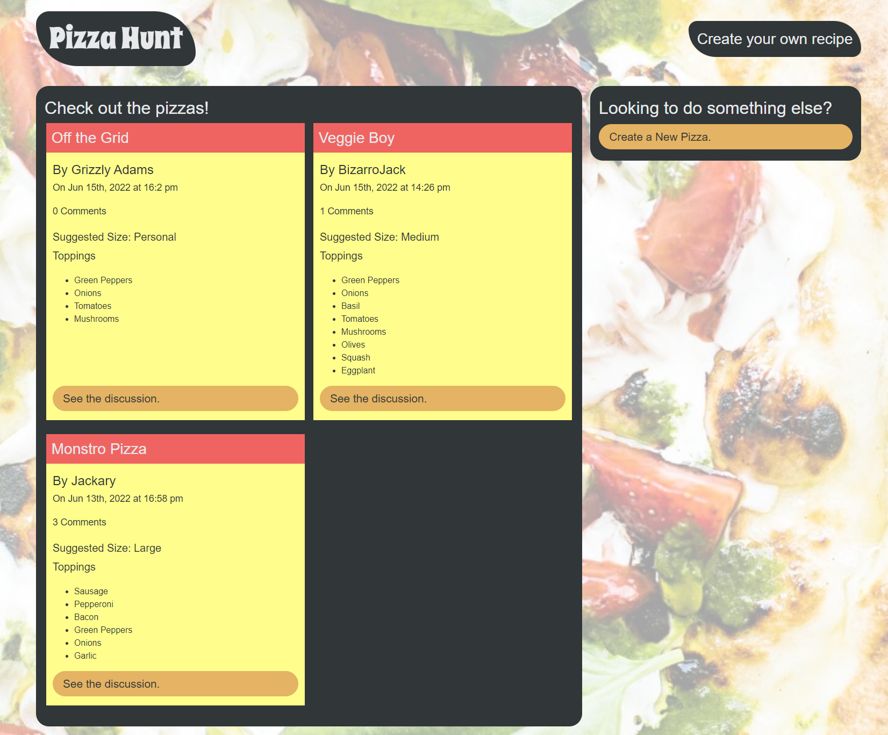
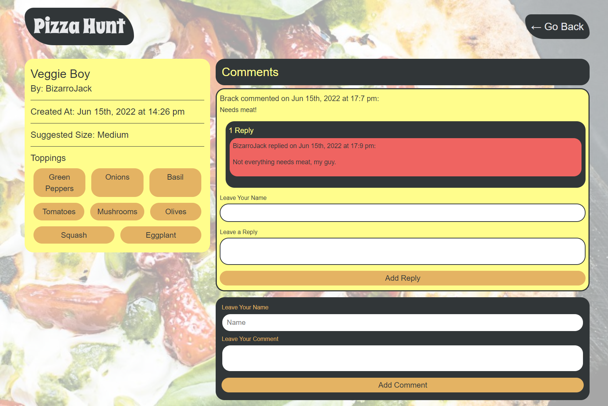
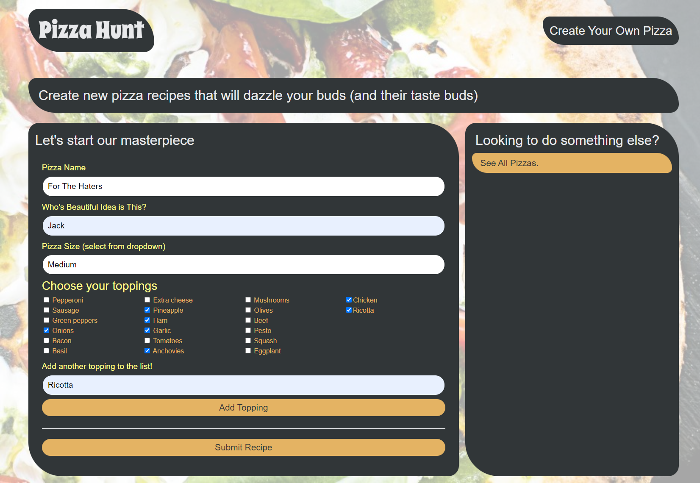

# Pizza Hunt

## Table of Contents

* [Description](#description)
* [Installation](#installation)
* [Usage](#usage)
* [Additional Information](#additional-information)

## [Description](#table-of-contents)
Pizza Hunt is a social PWA (progressive web application) where users can post custom pizza recipes, comment on pizza recipes, and reply to any comments. This was created as a practice project for learning NoSQL, MongoDB, Mongoose, and IndexedDB concepts.

## [Installation](#table-of-contents)
1. To work with this code base, clone this repository with `git clone`
2. While in the root directory, run `npm install` to install dependencies.
3. Start the server with `npm start`

*NOTE: **Node.js** and **MongoDB** are required to be installed on your machine prior to working with the codebase. For more information on installing **MongoDB**, [check out this link](https://www.mongodb.com/docs/manual/installation/)*

## [Usage](#table-of-contents)
Pizza Hunt is deployed to Heroku here: [Pizza Hunt](https://bshs-pizzahunt.herokuapp.com/)

The landing page contains all user created pizzas: 

Clicking on the "See the discussion" button on a pizza will take you to that specific pizza's page, where a user can see all comments, post a new comment, or reply to existing comments: 

Use the "Create a New Pizza" button to create a new recipe from the creation form. As a feature, custom toppings can be created and applied: 

Offline Pizza Creation: using IndexedDB, if a connection is weak or lost, a user can still create a new pizza recipe. The recipe is stored to indexedDB until a connection is restored in which the application will post the data accordingly.

## [Additional Information](#table-of-contents)
**Technologies Used:**
* Node.js
* Express.kjs
* NoSQL
* MongoDB
* Mongoose
* IndexedDb

**Links:**

See the fully deployed application here: [Pizza Hunt](https://bshs-pizzahunt.herokuapp.com/)

Project Repo: [blindsweatyhansolo/pizza-hunt](https://github.com/blindsweatyhansolo/pizza-hunt)

Questions and feedback always welcome. Check out more of my work here:
 [blindsweatyhansolo](https://github.com/blindsweatyhansolo)